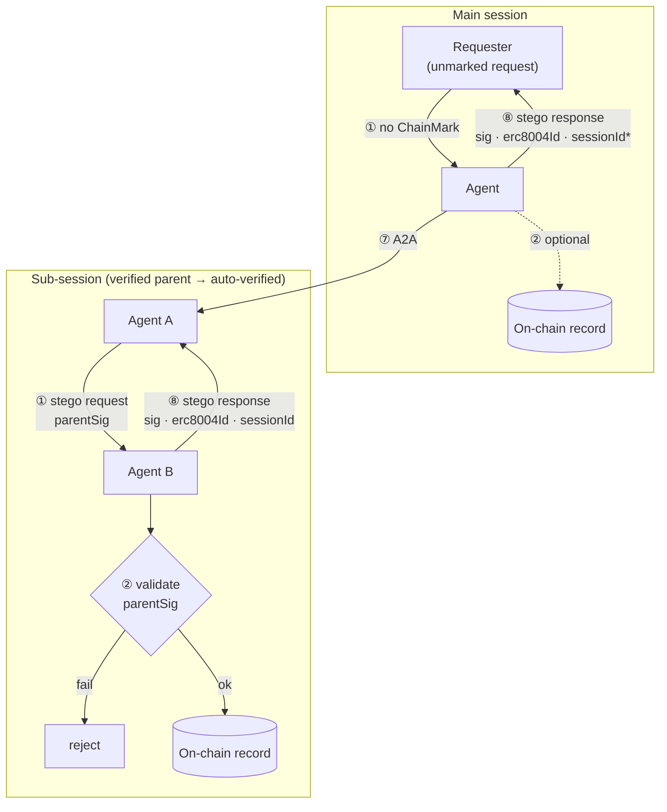

# TraceWeave — Architecture

## Summary

TraceWeave is a protocol for verifiable AI agent interactions built on ERC-8004. It combines cryptography, steganographic embedding in LLM output, and on-chain session metadata storage.

**Repository goal:** implement the protocol within a full agentic workflow — local LLM inference, tool calls, agent-to-agent interaction (A2A), and artifact generation.

**Core property:** any interaction in a global swarm of ERC-8004 agents is traceable back to the original prompter (a human or a request originating outside TraceWeave).

**External dependencies:**
- ERC-8004 — identity and discovery; integration via [agent0 SDK](https://sdk.ag0.xyz/docs)
- MCP — tools
- A2A — inter-agent communication
- Outlines — structured output for agent action selection (tool / A2A / respond)
- llama-cpp-python — local LLM inference (via Outlines)
- ChainMark steganography algorythm

---

## 1. Session, Watermarking, and On-Chain Flow

### 1.1 Session modes

When an agent receives a **session-initiating prompt**, it either:

- decides on its own whether to apply TraceWeave marking, or
- receives a reference to a parent session and applies marking **automatically** (sub-session path).

On-chain session record creation is **optional**. If no on-chain record is created, the session is still verifiable **locally** between the requester and the agent (signature + ChainMark embedding). A global on-chain record is written only when the agent opts into global verification (e.g. the request explicitly requires it, or the topic is important/complex enough). For a **main session**, that opt-in is a **model judgment** (see §2.3, §2.8) — not a deterministic rule in session management code. If a parent session is globally verified (watermark references the blockchain), all sub-sessions within that chat are globally verified by default.

---

### 1.2 Main session

1. An **unmarked** interaction request arrives.

2. The agent **optionally** creates an on-chain record under its ERC-8004 identity for session start, storing the **query hash** and **initiator address**.

3. The agent builds the signing payload from: **initiator address**, **query hash**.

4. The agent **signs** the payload with its key.

5. The agent samples tokens and embeds via ChainMark:
   - **signature**
   - **erc8004 id**
   - if an on-chain record was created: **session id**
   - if no on-chain record: **initiator address** (the prompt hash can be derived from the prompt itself and does not need to be embedded)

6. **Tool calls:**
   - If the tool call **produces an artifact** → embedding restarts from index 0 for bytes passed as artifact body.
   - If it does **not** produce an artifact → no embedding for that segment.
   - Embedding does **not** apply to tokens that carry **structured content** (code, tool calls). Embedding applies only to content that **fills an artifact** (e.g. text written into a file).

7. If another agent is invoked (**A2A**), a **new session** is created within the current one (sub-session, §1.3).

8. The agent returns **stego-bearing output**.

9. **Signature bits** are distributed **linearly** across all messages produced by the agent within this session. **Signature rotation** (new session) occurs **by time**.

---

### 1.3 Sub-session

1. The agent receives a request with embedded:
   - **erc8004 id** of this session's initiator
   - **parent session id**
   - **signature** over (`parent session initiator address` + `parent session prompt hash`)

2. The agent reads the parent session's **initiator address** and **prompt hash** from chain using this session initiator's **erc8004 id** + **parent session id**, and validates the embedded signature against those values. If the signature does not match → **reject**. This guarantees that the root prompt chain originates from a human (or equivalent unmarked source).

3. The agent creates an on-chain record under its ERC-8004 identity for session start, storing:
   - **query hash**
   - **initiator address** of this session
   - **initiator erc8004 id**
   - **parent session id**

4. The agent builds the signing payload from: **query hash**, **initiator address** of this session.

5. The agent **signs** the payload with its key.

6. The agent samples tokens and embeds: **signature** + **erc8004 id** + **session id**.

7. **Tool calls** — same rules as main session (§1.2, step 6).

8. If another agent is invoked (**A2A**), a **new session** is created within the current one.

9. The agent returns **stego-bearing output**.

### 1.4 Flow overview



\* `sessionId` if on-chain record exists; otherwise `initiatorAddress` (§1.2 step 5).

---

## 2. Agent Runtime

This section describes how a TraceWeave-enabled agent executes the protocol (§1) in software. The runtime is a thin orchestration layer around standard agent protocols; ChainMark and session logic live in TraceWeave-owned modules.

### 2.1 Components

| Component | Responsibility |
|-----------|----------------|
| **Agent loop** | Turn cycle: decide action → execute → repeat until response |
| **Session manager** | Apply verification mode, on-chain writes, TTL rotation, parent/sub linkage |
| **ChainMark engine** | Sign payloads, embed/extract stego in token stream |
| **Inference** | Local LLM via Outlines + llama-cpp-python |
| **MCP client** | Tool discovery and invocation |
| **A2A client / server** | Outbound delegation (agent0) and inbound tasks |
| **ERC-8004 client** | Agent identity and registration (agent0 SDK) |

### 2.2 Two-phase generation

The runtime separates **action selection** from **response generation**:

**ACTION phase** — Outlines constrains output to a structured `AgentAction` schema (Pydantic). No ChainMark embedding. Used when the agent decides what to do next.

**RESPOND phase** — Free-text generation with ChainMark `LogitsProcessor` active. Used when the agent produces user-facing or artifact-filling content per §1.

Stego and structured grammar must not run in the same generation pass.

### 2.3 Agent action schemas (MVP)

**Session init** (main session only, before the action loop):

```python
class SessionInitAction(BaseModel):
    action: Literal["session_init"]
    verification: Literal["local", "global"]
```

The model chooses `local` or `global` based on criteria in §1.1 (system prompt / agent card — not runtime heuristics). Sub-sessions skip this step and inherit from the parent (§2.8).

**Agent actions** (main loop):

```python
class ToolCallAction(BaseModel):
    action: Literal["tool_call"]
    name: str
    arguments: dict

class A2ADelegateAction(BaseModel):
    action: Literal["a2a_delegate"]
    agent_url: str
    task: str

class RespondAction(BaseModel):
    action: Literal["respond"]

AgentAction = Annotated[
    Union[ToolCallAction, A2ADelegateAction, RespondAction],
    Field(discriminator="action"),
]
```

MCP tool definitions supply argument schemas; Outlines guarantees valid action structure. Argument validation against MCP `inputSchema` happens after decode.

### 2.4 Agent loop

```
1. Receive inbound request (unmarked → main session; marked → sub-session per §1.3)
2. IF sub-session:
     session = SessionManager.init_from_parent(parent)   — inherit verification; no model choice
   ELSE:
     init = model(messages, output_type=SessionInitAction)   — model chooses local | global
     session = SessionManager.init(verification=init.verification)
3. LOOP:
   a. action = model(messages, output_type=AgentAction)     — ACTION phase
   b. if tool_call:
        result = mcp.call_tool(name, arguments)
        apply embed policy (§1.2 step 6)
        append result to messages; continue
   c. if a2a_delegate:
        sub = SessionManager.spawn_sub(...)
        result = a2a_client.send_task(agent_url, task, sub.metadata)
        append result to messages; continue
   d. if respond:
        output = model(messages, processor=ChainMarkProcessor)  — RESPOND phase
        return stego-bearing output
4. SessionManager.touch(session) on activity; check TTL rotation (§1.2 step 9)
```

### 2.5 MCP integration

- Tools are standard MCP servers; the runtime is an MCP **client**.
- Tool results are classified for embed policy:
  - **structured** (code, tool-call tokens, JSON) → no embedding
  - **artifact body** (text written to file, document content) → ChainMark applies; index reset on new artifact per §1.2 step 6
- MCP tool schemas are exposed to Outlines as the action schema's `tool_call` branch (tool name + arguments).

### 2.6 A2A integration

- **Outbound:** agent0 SDK A2A client sends delegated tasks. Sub-session metadata (parent sig, session ids) is attached to the A2A task payload.
- **Inbound:** A2A server receives tasks, runs the same agent loop, validates parent session per §1.3 step 2 before proceeding.
- Sub-sessions inherit global verification when the parent watermark references the blockchain (§1.1).

### 2.7 ChainMark integration

- **RESPOND phase only:** `ChainMarkProcessor` biases logits during sampling.
- Signing payloads follow §1.2 / §1.3.
- Signature bits distributed linearly across agent messages in a session.
- Embed plaintext per §1.2 step 5 (session id if on-chain; initiator address if local-only).

ChainMark algorithm details — [ChainMark](docs/chainmark.md).

### 2.8 Session manager

State and chain I/O only — **no verification policy logic**.

Responsibilities:

- **Apply** verification mode (`local` | `global`) from `SessionInitAction` (main session), or **inherit** from parent (`init_from_parent` for sub-sessions)
- Create on-chain record when mode is `global`; omit when `local`
- Create / continue / rotate sessions (TTL)
- Maintain session context for signing and embedding (initiator, hashes, parent link, erc8004 id)
- Pass session metadata into A2A sub-session handoff

```python
class SessionManager:
    def init(self, verification: Literal["local", "global"], ...) -> Session:
        session.verification = verification
        if verification == "global":
            session.on_chain_id = self.registry.start_session(...)
        return session

    def init_from_parent(self, parent: Session) -> Session:
        session.verification = parent.verification
        if session.verification == "global":
            session.on_chain_id = self.registry.start_sub_session(...)
        return session
```

On-chain interaction via agent0 SDK + Session Registry contract (TBD).

### 2.9 What this runtime is not

- Not a full agent framework (no LangChain / ADK as core).
- Not responsible for model training or fine-tuning.
- Not replacing MCP, A2A, or ERC-8004 — only composing them with TraceWeave session and ChainMark layers.

---

## 3. Repository Structure

Monorepo. Python packages map to runtime components (§2.1). Protocol docs live in `docs/`.

```
TraceWeave/
├── docs/
├── packages/
│   ├── traceweave-core/
│   ├── traceweave-chainmark/
│   ├── traceweave-inference/
│   ├── traceweave-chain/
│   │   └── contracts/
│   └── traceweave-runtime/
├── examples/
│   ├── single-agent/
│   └── multi-agent/
└── README.md
```

### Package boundaries

| Package | Depends on | Exposes |
|---------|------------|---------|
| `traceweave-core` | chainmark, inference, chain, MCP, agent0 | `AgentLoop`, `SessionManager` |
| `traceweave-chainmark` | — | `ChainMarkEngine`, `ChainMarkProcessor` |
| `traceweave-inference` | outlines, llama-cpp-python | configured Outlines model |
| `traceweave-chain` | agent0-sdk, web3 | Session Registry client |
| `traceweave-runtime` | core | CLI, A2A server |

`traceweave-runtime` is the only deployable entrypoint; other packages are libraries.
